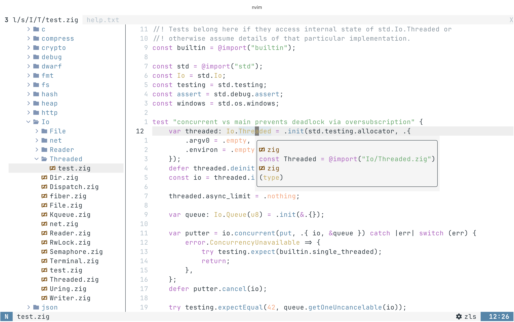
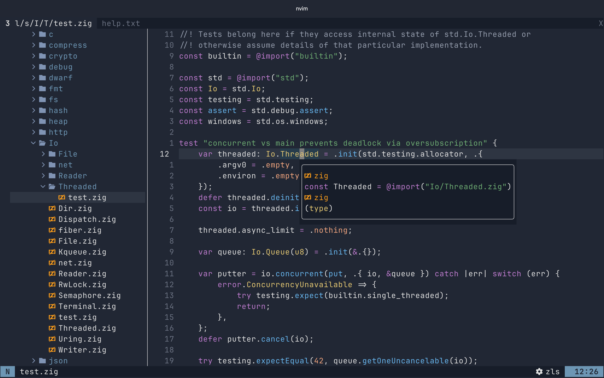

# Mac Clear

Mac Clear is a [Neovim](https://github.com/neovim/neovim) theme ported from the MacOS Terminal themes:
`Clear Dark` and `Clear Light`.





## Requirements

- [Neovim](https://github.com/neovim/neovim) >= [0.12](https://github.com/neovim/neovim/releases/tag/v0.12.0) (Actually I don't check if it works for lower versions...hope it does! )

## Better Experience

- Use it in MacOS Terminal with the `Clear Light` or `Clear Dark` profile
- Use it in [Ghostty](https://github.com/ghostty-org/ghostty) with these two ghostty themes: [mac-clear-light](https://github.com/boningmaple/dotfiles/blob/main/ghostty/.config/ghostty/themes/mac-clear-light) and [mac-clear-dark](https://github.com/boningmaple/dotfiles/blob/main/ghostty/.config/ghostty/themes/mac-clear-dark)

## Installation

Using Neovim's native package manager:

```lua
vim.pack.add({ "https://github.com/boningmaple/mac-clear" })
```

## Usage

Use `mac-clear` to automatically switch between light and dark mode based on your
system mode.

```lua
vim.cmd.colorscheme("mac-clear")
```

Or choose light or dark directly:

```lua
-- light
vim.cmd.colorscheme("mac-clear-light")

-- dark
vim.cmd.colorscheme("mac-clear-dark")
```

You do not need to call `setup()` or configure anything unless you want to
override colors or highlight groups.

## Overrides

Call `setup()` before running `vim.cmd.colorscheme("mac-clear")` if you want
to customize it.

> Check [lua/mac-clear/colors.lua](lua/mac-clear/colors.lua) for available
> colors and [lua/mac-clear/groups.lua](lua/mac-clear/groups.lua) for more
> highlight group examples.

```lua
require("mac-clear").setup({
    colors_overrides = function(theme)
        return {
            -- One color for both light and dark.
            blue = "#ad64be",

            -- Or use different colors for light and dark.
            magenta = theme == "light" and "#ffffff" or "#abcabc",

            -- Or define a new color that is not in this colorscheme
            new_color = theme == "light" and "#b44444" or "#b55555",
        }
    end,

    groups_overrides = function(theme, colors)
        return {
            -- Use raw colors directly.
            Normal = { bg = "#000000", fg = "#ffffff" },

            -- Or use the colors.
            Keyword = { fg = colors.magenta },

            -- Or use different colors for light and dark.
            Function = { fg = theme == "light" and colors.blue or colors.red },

            -- Or use your new color
            Identifier = { fg = colors.new_color }
        }
    end,
})

vim.cmd.colorscheme("mac-clear")
```

